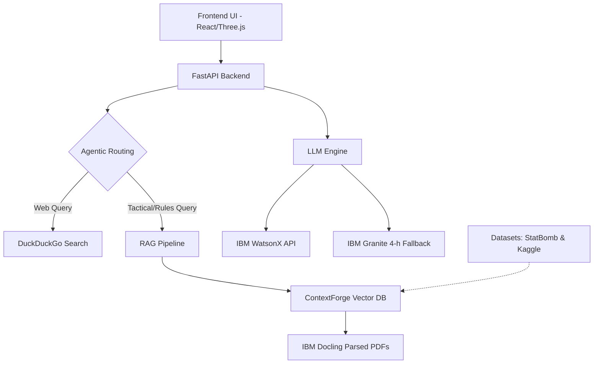

# 🧠 Footy Mind — The Ultimate AI Tactical Assistant

> **IBM SkillsBuild Hackathon**
> Built with IBM Docling · ContextForge · WatsonX · Granite 4-h · React Three Fiber · IBM Bob

**Team:** Mohammed Ayaan Adil Ahmed and Leana Gomez

---

## The Problem

Standard AI chatbots fall short when dealing with highly specific domain knowledge—like the 200-page FIFA Laws of the Game, or complex UEFA tactical analyses. They guess, hallucinate, or give outdated information.

Tactical analysis in football is incredibly complex. Fans watch matches without fully understanding the underlying philosophies, and standard search engines don't provide interactive, visual explanations of formations and player roles.

**Footy Mind bridges that gap.**

---

## What It Does

Footy Mind is an interactive, fully-fledged 3D tactical football dashboard supercharged by cutting-edge Generative AI. 

### Core features:

**1. The 3D Tactical Pitch**
Powered by `React Three Fiber`, this fully interactive 3D pitch allows you to visually explore tactical formations, view player positioning, and study football philosophies.
- Drag & Drop: Move players around the pitch.
- Player Stats: Click on any player (pitch or bench) to view their detailed tactical roles, heatmaps, and stats based on real data.

**2. Agentic Web Search**
If you ask the Chatbot about future events (like the "2026 World Cup format"), it autonomously decides to use **DuckDuckGo** to search the live web. It reads the search results, synthesizes the facts, and replies with up-to-date information.

**3. Fan Zone & Mini-Games**
- Live Match Data: View simulated live fixtures and make score predictions.
- Bobblehead Game: A fun, physics-based 2D canvas mini-game.
- Football Dictionary & Philosophies: Explore the history of football tactics from *Gegenpressing* to *Tiki-Taka*.

**4. Bring Your Own Key (BYOK) via the Chatbox Gear Icon**
Footy Mind is designed for flexibility. Click the **gear icon (⚙️)** in the chatbox to securely input your own **IBM WatsonX / Granite API Keys**. These keys are stored locally in your browser's session. If you don't have keys (or if they expire), the application seamlessly falls back to our robust IBM Granite 4-h model for inference so the experience never breaks!

---

## Why It Matters in Football

- Tactical analysis requires precise, up-to-date knowledge that generic LLMs lack.
- Interactive visual learning (like our 3D pitch) is far more effective than reading text summaries.
- Our AI Assistant doesn't just guess; it reads the official rulebooks and live web sources to provide verified facts.

---

## AI, Technical Approach & Architecture

### IBM Tools & AI Development
- **IBM Docling (The Eyes):** An advanced AI parser that perfectly ingests complex documents. It intelligently extracts the layout, tables, and paragraphs from tactical PDFs into pristine, structured text.
- **ContextForge (The Brain):** Acts as a Knowledge Graph and Vector Database manager. It breaks massive documents into bite-sized chunks and retrieves *only* the most relevant paragraphs for the AI's memory.
- **IBM Granite 4-h:** The primary LLM (`ibm/granite-4-h-small`) used for reasoning over football data and providing grounded responses.
- **IBM Bob (Co-Developer):** A special shoutout to **IBM Bob** (our nickname for the DeepMind AI assistant that worked tirelessly as our co-developer). While we guided the vision, architecture, and design, IBM Bob helped us write the code, squash the bugs, and seamlessly integrate the IBM Docling ecosystem!

### Data Sources
To ground our AI and provide realistic stats and analysis, we utilized comprehensive football datasets:
- **StatBomb:** Used for high-quality, detailed tactical event data.
- **Kaggle (1 Dataset):** We ingested the `rovnez/fc-26-fifa-26-player-data` dataset to populate player attributes and statistics.

### System Architecture



---

## 🛠️ Tech Stack

**Frontend:**
- React 18 (Vite)
- Tailwind CSS (Glassmorphism styling)
- Three.js / React Three Fiber / Drei
- Lucide React

**Backend:**
- Python FastAPI
- IBM Docling (Advanced PDF Ingestion)
- LangChain Core & LangChain IBM (WatsonX integration)
- DuckDuckGo Search Tools
- IBM Granite Inference

---

## 💻 How to Run Locally

### 1. Start the Python Backend
```bash
cd backend
python -m venv venv
venv\Scripts\activate  # On Windows
pip install -r requirements.txt
pip install langchain-ibm
uvicorn main:app --reload
```

### 2. Start the Frontend UI
```bash
npm install
npm run dev
```

### 3. Environment Variables
Create a `.env` file in the `backend` folder:
```env
# Add necessary WatsonX / Granite API keys here
```

---

## 🚀 Deployment Recommendations

1. **Frontend (Vercel):** Connect your GitHub repo to Vercel.
2. **Backend (Hugging Face Spaces):** Create a Docker Space on Hugging Face and deploy your backend there.

---

*Built for the IBM SkillsBuild Hackathon by Mohammed Ayaan Adil Ahmed and Leana Gomez.*